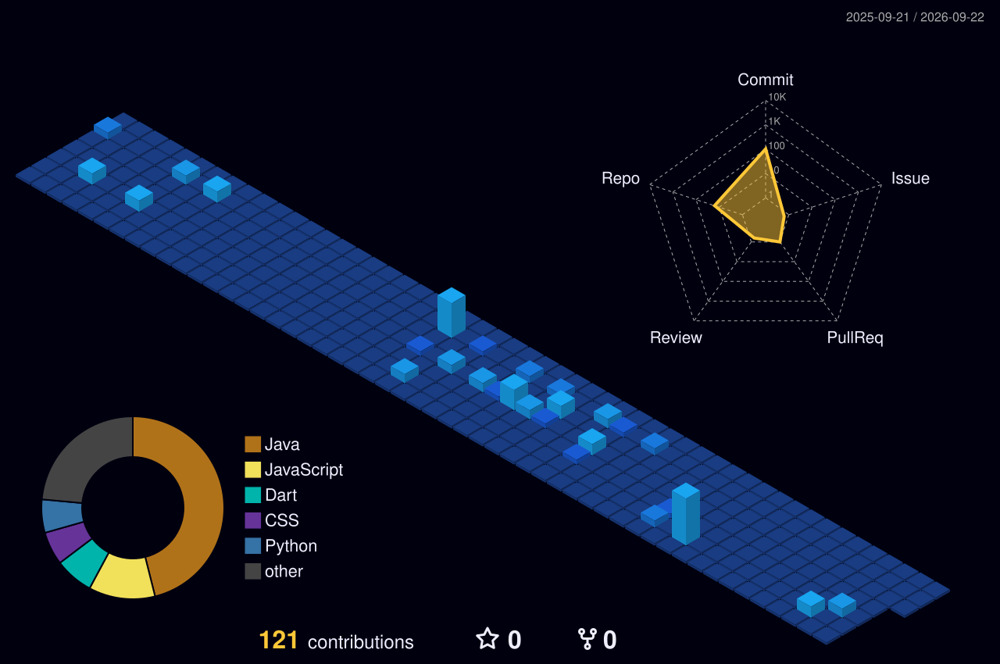

<h1 align="center"> Olá, eu sou o JP! 👋 </h1>

  <!-- Efeito de digitação para o subtítulo -->
  

---

### 💻 Linguagens e Tecnologias

  
  
  
  
  

### 🎨 Ferramentas de UI/UX & Prototipação

  
  

---

### 📊 GitHub Stats

---

### 🏙️ Minhas Contribuições em 3D

  

---

### 🎓 Background Acadêmico

- 🎓 **Sistemas de Informação** | *Universidade Federal da Bahia (UFBA)* 
- 💻 **Desenvolvimento de Sistemas** | *Serviço Nacional de Aprendizagem Industrial (SENAI)*
